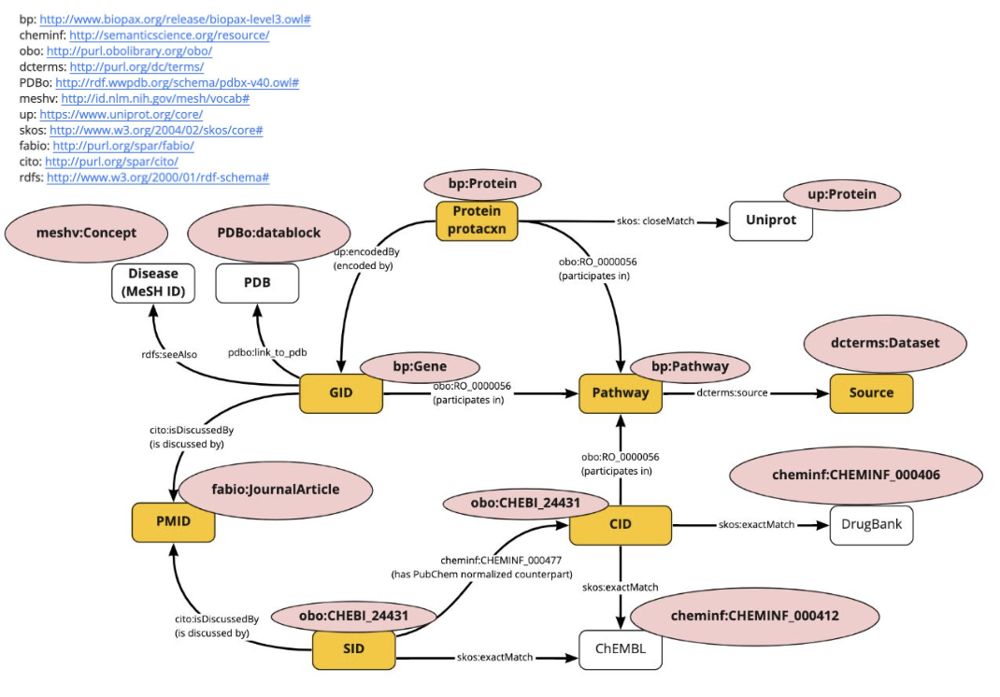

# glycovid_PubChem
## RDF schema


## System overview
- Scrape PubChem web resources in `https://pubchem.ncbi.nlm.nih.gov/#query=covid-19`
- Currently, it is proposed that RDF data created using this plugin on July 22, 2022 can be accessed from [GlyCosmos endpoint](https://ts.glycosmos.org/sparql) using the graph name `http://rdf.glycosmos.org/glycovid_ pubchem` using SPARQL.
- By using this program to perform scraping and RDFization, the latest PubChem data can be updated with only the differences. If you want to create RDF data from scratch, you can do so by deleting all csv files in the `datalist_csv` directory.

## Requirements
- pyhton 3.9.14

## How to use
``` bash
# Scrape data by chromedriver
python rdf.py
# Create ttl file from scraped csv files
python create_ttl.py
# Create owl file from ttl
python create_owl.py
# Create ShEx files of created RDF file by sheXer.
python shexer/main.py
```
RDF files will be generated in tutle/ directory.

## Tree description
``` bash
PubChem
├── data                       # PubChem data scraped by rdf.py
├── datalist_csv               
├── shexer                     # A sheXer script and ShEx files generated by sheXer to validate RDF data.
│   ├── main.py                # sheXer script.
│   └── shex_{time}.shex       # ShEx script generated by main.py.
├── source                     # Souce code to scrape PubChem web page.
├── turtle                     # RDF files outputs by RDFization.
├── rdf.py                     # Python script to scrape PubChem web resources.
└── create_ttl.py              # Create rdf files from scraped data in data/ directroy.
```

%% ## Sup
%% # Scrape PubChem data resorces
%% python rdf.py
%%
%% ### Purpose
%% PubChemサイトのcovid19ページからプロジェクトで必要なデータである遺伝子、タンパク質、パスウェイの情報をcsvファイルとしてダウンロードする。次にそのファイルからRDFを作るために不必要なデータを削除し整形する。最後に、ファイルを種類別に統合させて一つのファイルにする。それぞれの過程を実行するプログラムをPythonの言語によって実装した。
%%
%% ### Steps
%%
%% #### Step1 スクレイピング
%% ＊まず上記のPubchemページへアクセスし、タブ"gene"をクリックする。https://pubchem.ncbi.nlm.nih.gov/#query=covid-19&tab=gene
%% そして、右側のSummaryというボタンを押し、csvファイルをダウンロードする。このcsvファイルにはcovid19に関連するすべての遺伝子情報が含まれており、PubChem独自のIDで管理されている。
%%
%% ＊次に、rdf.pyのscrape()関数を実行する。ただし、chromedriverを使ったブラウザクローリングを行うスクレイピングのため、GooggleChromeとchromedriverのバージョンを同期しておく必要がある。また、chromedriverは実行する環境下のディレクトリで管理する必要がある。scrape()関数内で、絶対パスを通す必要がある。
%%
%% #### Step2 ディレクトリ作成
%% ＊スクレイピング後、ファイルを一つにするプログラムを実行するためにそれぞれのファイルを種類別のディレクトリに移動する。rdf.pyのmkdir()関数で実行される。ただし、実行する環境内で、事前に空のディレクトリを準備しておく必要がある。ディレクトリ名は、pdb, bioactive_gene, drugbank, chembldrug, gtopdb, bioassay, gene-disease, dgidb, ctdchemicalgene, pathwayreaction, pathwaygeneである。
%%
%% #### Step3 csvファイルの結合
%% 種類別にcsvファイルを管理できたあと、不必要なカラムは落とし、ファイルを一つに結合する。rdf.pyのmk_csv_for_togo()関数で実行される。
