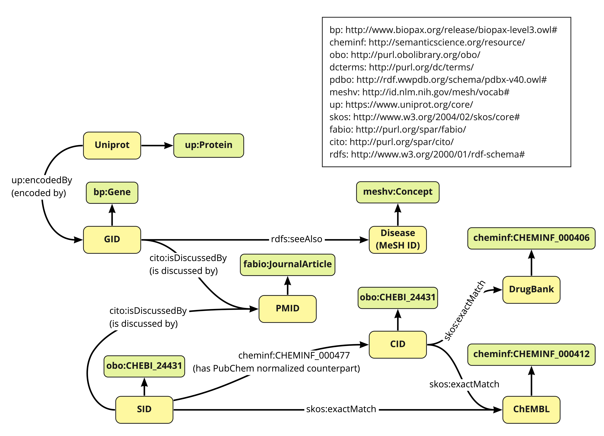
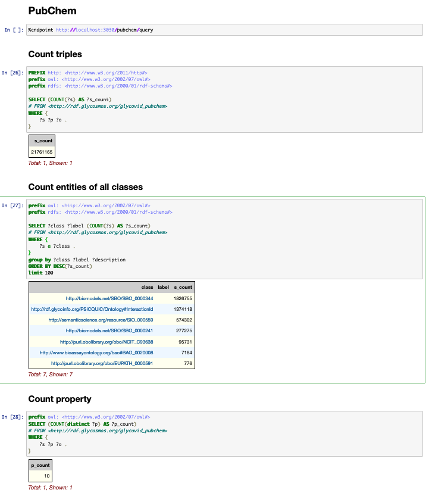

# glycovid_PubChem
## RDF schema


## System overview
- Scrape PubChem web resources in `https://pubchem.ncbi.nlm.nih.gov/#query=covid-19`
- Currently, it is proposed that RDF data created using this plugin on July 22, 2022 can be accessed from [GlyCosmos endpoint](https://ts.glycosmos.org/sparql) using the graph name `http://rdf.glycosmos.org/glycovid_ pubchem` using SPARQL.
- By using this program to perform scraping and RDFization, the latest PubChem data can be updated with only the differences. If you want to create RDF data from scratch, you can do so by deleting all csv files in the `datalist_csv` directory.

## Requirements
- pyhton 3.9.14

## How to use
``` bash
# Scrape data by chromedriver
python rdf.py
# Create ttl file from scraped csv files
python create_ttl.py
# Create owl file from ttl
python create_owl.py
# Create ShEx files of created RDF file by sheXer.
python shexer/main.py
```
RDF files will be generated in tutle/ directory.

## Tree description
``` bash
PubChem
├── data                       # PubChem data scraped by rdf.py
├── datalist_csv               
├── shexer                     # A sheXer script and ShEx files generated by sheXer to validate RDF data.
│   ├── main.py                # sheXer script.
│   └── shex_{time}.shex       # ShEx script generated by main.py.
├── source                     # Souce code to scrape PubChem web page.
├── turtle                     # RDF files outputs by RDFization.
├── rdf.py                     # Python script to scrape PubChem web resources.
└── create_ttl.py              # Create rdf files from scraped data in data/ directroy.
```

## Data overview


## ShEx file by sheXer
[[shexer/shex_20221202112539.shex]]

## Sample triples
``` ttl
# gid
<http://rdf.ncbi.nlm.nih.gov/pubchem/gene/GID10238> a <http://www.biopax.org/release/biopax-level3.owl#Gene> ;
    ns1:isDiscussedBy <https://identifiers.org/pubmed:16759393>,
        <https://identifiers.org/pubmed:24056718> ;
    rdfs:seeAlso <https://id.nlm.nih.gov/mesh/C566025>,
        <https://id.nlm.nih.gov/mesh/D019465> .
# sid
<http://rdf.ncbi.nlm.nih.gov/pubchem/substance/SID103163815> a <http://purl.obolibrary.org/obo/CHEBI_24431> ;
    ns1:isDiscussedBy <https://identifiers.org/pubmed:31563012> ;
    ns2:CHEMINF_000477 <http://rdf.ncbi.nlm.nih.gov/pubchem/compound/CID5281855> .
# cid
<http://rdf.ncbi.nlm.nih.gov/pubchem/compound/CID10029385> a <http://purl.obolibrary.org/obo/CHEBI_24431> ;
    ns2:exactMatch <http://rdf.ebi.ac.uk/resource/chembl/molecule/CHEMBL362558> .
# protein
<http://purl.uniprot.org/uniprot/O15111> a ns3:Protein ;
    ns3:encodedBy <http://rdf.ncbi.nlm.nih.gov/pubchem/gene/GID1147>,
        <http://rdf.ncbi.nlm.nih.gov/pubchem/gene/GID3551> .
# pmid
<https://identifiers.org/pubmed:31411465> a <http://purl.org/spar/fabio/JournalArticle> .
# chembl
<http://rdf.ebi.ac.uk/resource/chembl/molecule/CHEMBL1014> a <http://semanticscience.org/resource/CHEMINF_000412> .
# drugbank
<https://identifiers.org/drugbank:DB00104> a <http://semanticscience.org/resource/CHEMINF_000406> .
# disease
<https://id.nlm.nih.gov/mesh/D006973> a <http://id.nlm.nih.gov/mesh/vocab#Concept> .
```
